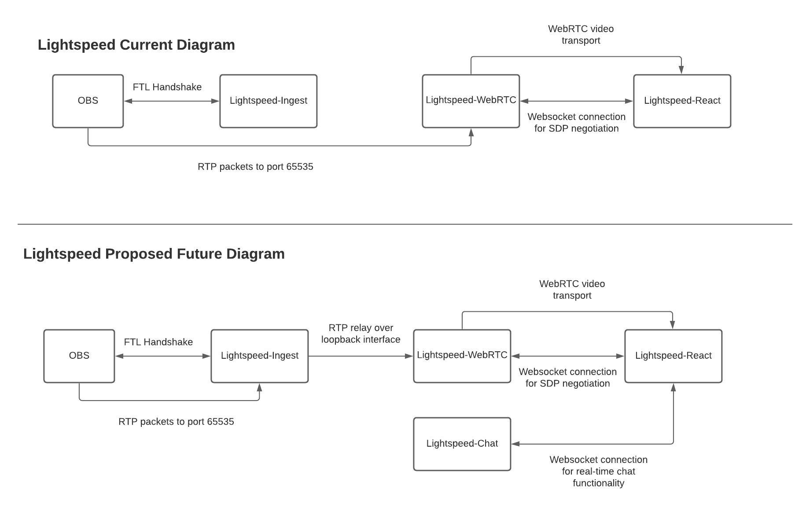

<p align="center">
<a  href="https://github.com/acarlton5/ITGv2">
    
</a>
</p>
  <h1 align="center">Project ITG</h1>
<div align="center">
    <a href="https://github.com/acarlton5/ITGv2/stargazers"></a>
    <a href="https://github.com/acarlton5/ITGv2/network/members"></a>
    <a href="https://github.com/acarlton5/ITGv2/pulls"></a>
    <a href="https://github.com/acarlton5/ITGv2/issues"></a>
    <a href="https://github.com/acarlton5/ITGv2/graphs/contributors"></a>
    <a href="https://github.com/acarlton5/ITGv2/blob/master/LICENSE"></a>
</div>
<br />
<p align="center">
    A self contained OBS -> FTL -> WebRTC live streaming server. Comprised of 3 parts once configured anyone can achieve sub-second OBS to the browser livestreaming 
    <br />
    <br />
    <a href="https://youtu.be/Dzin4_A8RDs">View Demo</a>
    ·
    <a href="https://github.com/acarlton5/ITGv2/issues">Report a Bug</a>
    ·
    <a href="https://github.com/acarlton5/ITGv2/issues">Request Features</a>
</p>

<!-- TABLE OF CONTENTS -->
<details open="open">
  <summary><h2 style="display: inline-block">Table of Contents</h2></summary>
  <ol>
    <li>
      <a href="#about-the-project">About The Project</a>
      <ul>
        <li><ul>
          <li><a href="#how-it-works">How It Works</a></li>
          <li><a href="#diagram">Diagram</a</li>
        </ul></li>
        <li><a href="#built-with">Built With</a></li>
        <li><a href="#components">Components</a></li>
      </ul>
    </li>
    <li><a href="#discord">Discord</a></li>
    <li>
      <a href="#getting-started">Getting Started</a>
      <ul>
        <li><a href="#prerequisites">Prerequisites</a></li>
        <li><a href="#installation">Installation</a>
            <ul>
                <li><a href="#itg-ingest">ITG Ingest</a></li>
                <li><a href="#itg-webrtc">ITG WebRTC</a></li>
                <li><a href="#itg-react">ITG React</a></li>
            </ul>
        </li>
        <li><a href="#community-installation">Community Installation</a></li>
      </ul>
    </li>
    <li><a href="#usage">Usage</a></li>
    <li><a href="#streaming-from-obs">Streaming From OBS</a>
        <ul>
            <li><a href="#stream-key">Stream Key</a></li>
        </ul>
    </li>  
    <li><a href="#help">Help</a></li>
    <li><a href="#roadmap">Roadmap</a></li>
    <li><a href="#bugs">Bugs</a></li>
    <li><a href="#contributing">Contributing</a></li>
    <li><a href="#license">License</a></li>
    <li><a href="#contact">Contact</a></li>
    <li><a href="#acknowledgements">Acknowledgements</a></li>
  </ol>
</details>

<!-- ABOUT THE PROJECT -->

## About The Project

<!-- [![Product Name Screen Shot][product-screenshot]](https://example.com) -->

Project ITG is a fully self-contained live streaming server. With ITG you will be able to deploy your 
own sub-second latency live streaming platform. The ITG repository contains the instructions for installing 
and deploying the entire application. So far, ITG includes an ingest service, broadcast service via webRTC 
and a web application for viewing. ITG is however completely modular. What this means is that you can write 
your own web app, ingest server or broadcast server. 

### How It Works

ITG Ingest listens on port 8084 which is the port used by the FTL protocol. Upon receiving a connection it completes the FTL handshake and negotiates a port (this is currently bugged however and defaults to 65535). Once the negotiation is done ITG WebRTC listens on the negotiated port (in the future ITG WebRTC will listen on the loopback interface so the ingest has more control on what packets we accept) and relays the incoming RTP packets over WebRTC. ITG React communicates via websocket with ITG WebRTC to exchange ICE Candidates and once a connection is established the video can be viewed

### Diagram
Here is a diagram that outlines the current implementation and the future implementation that I would like to achieve. The reason I want the packets relayed from Ingest to WebRTC on the loopback interface is so that we have more control over who can send packets. Meaning that when a DISCONNECT command is recieved we can terminate the UDP listener so that someone could not start sending packets that we do not want



### Built With

- Rust
- Golang
- React

### Components

- [ITG Ingest]
- [ITG WebRTC]
- [ITG React]

## Discord
We now have a [Discord](https://discord.gg/UpQZANPYmZ) server! This is a great way to stay up to date with the project and join in on the conversation! Come stop by!

<!-- GETTING STARTED -->

## Getting Started

In order to get a copy running you will need to install all 3 repositories. There are installation instructions in 
each repo however I will include them here for the sake of simplicity

### Prerequisites

In order to run ITG, [Golang](https://golang.org/doc/install),
[Rust](https://www.rust-lang.org/tools/install), and
[npm](https://www.npmjs.com/get-npm) are required. Additionally the Rust repo
requires a C compiler. If you get a `linker cc not found` error then you need to
install a C compiler


### Installation

1. **Clone Repository**

   ```sh
   git clone https://github.com/acarlton5/ITGv2
   cd ITGv2
   ```


2. **Build Ingest Server**

   ```sh
   cd ingest
   cargo build
   cd ..
   ```

3. **Build WebRTC Server**

   ```sh
   cd webrtc
   go build
   cd ..
   ```

4. **Build Frontend**
  
   ```sh
   cd frontend
   npm install
   ```


<!-- USAGE EXAMPLES -->

## Usage

#### ITG Ingest

```sh
cd ingest
cargo run --release
```

#### ITG WebRTC

Using git

```sh
cd webrtc
go build
./itg-webrtc --addr=XXX.XXX.XXX.XXX
```

##### Arguments

|  Argument | Supported Values | Defaults | Notes             |
| :-------- | :--------------- | :------- | :---------------- |
| `--addr`   | A valid IP address | `localhost` | This is the local Ip address of your machine. It defaults to localhost but should be set to your local IP. For example 10.17.0.5 This is where the server will listen for UDP packets and where it will host the websocket endpoint for SDP negotiation|
|  `--ip`    | A valid IP address | `none` | Sets the public IP address for WebRTC to use. |
| `--ports`  | A valid UDP port range | `20000-20500` | This sets the UDP ports that WebRTC will use to connect with the client |
| `--ws-port` | A valid port number | `8080` | This is the port on which the websocket will be hosted. If you change this value make sure that is reflected in the URL used by the react client |
| `--rtp-port` | A valid port number | `65535` | This is the port on which the WebRTC service will listen for RTP packets. Ensure this is the same port that ITG Ingest is negotiating with the client |
| `--ice-servers` | A comma separated list of hosts | `none` | List of ICE / STUN servers used by WebRTC for setting up the network connection with the clients |

#### ITG React

You should then configure the websocket URL in `config.json` in the `build` directory. If you are using an IP then it will be the 
public IP of your machine if you have DNS then it will be your hostname

**Note**: The websocket port is hardcoded meaning that ITG-webrtc will always serve it on port 8080 (this may change in the future) 
so for the websocket config it needs to be `ws://IP_or_Hostname:8080/websocket`

You can host the static site locally using `serve` which can be found [here](https://www.npmjs.com/package/serve)

**Note**: your version of `serve` may require the `-p` flag instead of `-l` for the port
```sh
cd frontend
npm install
# If the build fails with an OpenSSL error (common on Node 17+)
export NODE_OPTIONS=--openssl-legacy-provider
npm run build
serve -s build -l 80
```

The above will serve the build folder on port 80

View ITG in your web browser by visiting http://hostname or http://your.ip.address.here

---

## Streaming From OBS

By default, since we are using the FTL protocol, you cannot just use a Custom server. You will need to edit 
your `services.json` file. It can be found at:
- Windows: `%AppData%\obs-studio\plugin_config\rtmp-services\services.json` 
- OSX: `/Users/YOURUSERNAME/Library/Application\ Support/obs-studio/plugin_config/rtmp-services/services.json`

**Note**: Not all versions of Linux have access to OBS with the FTL SDK built in. If you are on Linux and you cannot stream to ITG this may be the issue

Paste the below into the services array and change the url to either the IP or the hostname of your Project ITG server

**Note**: for the url it is not prefaced by anything. For example, given an IP of 10.0.0.2 you would put `"url": "10.0.0.2"` You do not need to indicate a port since the FTL protocol always uses 8084
```json
{
    "name": "ITG",
    "common": false,
    "servers": [
        {
            "name": "SERVER TITLE HERE",
            "url": "your.ITG.hostname"
        }
    ],
    "recommended": {
        "keyint": 2,
        "output": "ftl_output",
        "max audio bitrate": 160,
        "max video bitrate": 8000,
        "profile": "main",
        "bframes": 0
    }
},
```

NOTE: You do not need to specify a port

After restarting OBS you should be able to see your service in the OBS settings Stream pane
(Special Thanks to [Glimesh](https://github.com/Glimesh) for these instructions)

---

### Stream Key
Stream keys are now managed through your **NOIZ dashboard** and validated by a
separate authentication service. Log in to your NOIZ account and create a stream
to obtain the key. Enter this key into OBS when configuring your stream. You can
revoke or regenerate keys at any time from the dashboard.

### Multi-User Streaming

When a streamer connects, the ingest service requests a dedicated UDP port from the WebRTC server using `WEBRTC_SERVER_URL`. That port hosts the stream until it ends, after which it is freed automatically. Each start and stop event is also sent to your auth service via `AUTH_WS_URL` so stream keys can be validated and tracked. Viewers connect to `/websocket?port=<allocated port>` to watch a specific stream

<!-- ROADMAP -->

## Bugs

I am very from perfect and there are bound to be bugs and things I've overlooked in the installation process. 
Please, add issues and feel free to reach out if anything is unclear. Also, we have a Discord

<!-- CONTRIBUTING -->

## Contributing

Contributions are what make the open source community such an amazing place to be learn, inspire, and create. 
Any contributions you make are **greatly appreciated**. 

1. Fork the Project
2. Create your Feature Branch: ``git checkout -b feature/AmazingFeature``
3. Commit your Changes: ``git commit -m 'Add some AmazingFeature'``
4. Push to the Branch: ``git push origin feature/AmazingFeature``
5. Open a Pull Request

<!-- LICENSE -->

## License

Distributed under the MIT License. See `LICENSE` for more information

<!-- CONTACT -->

## Contact

<!-- ACKNOWLEDGEMENTS -->

